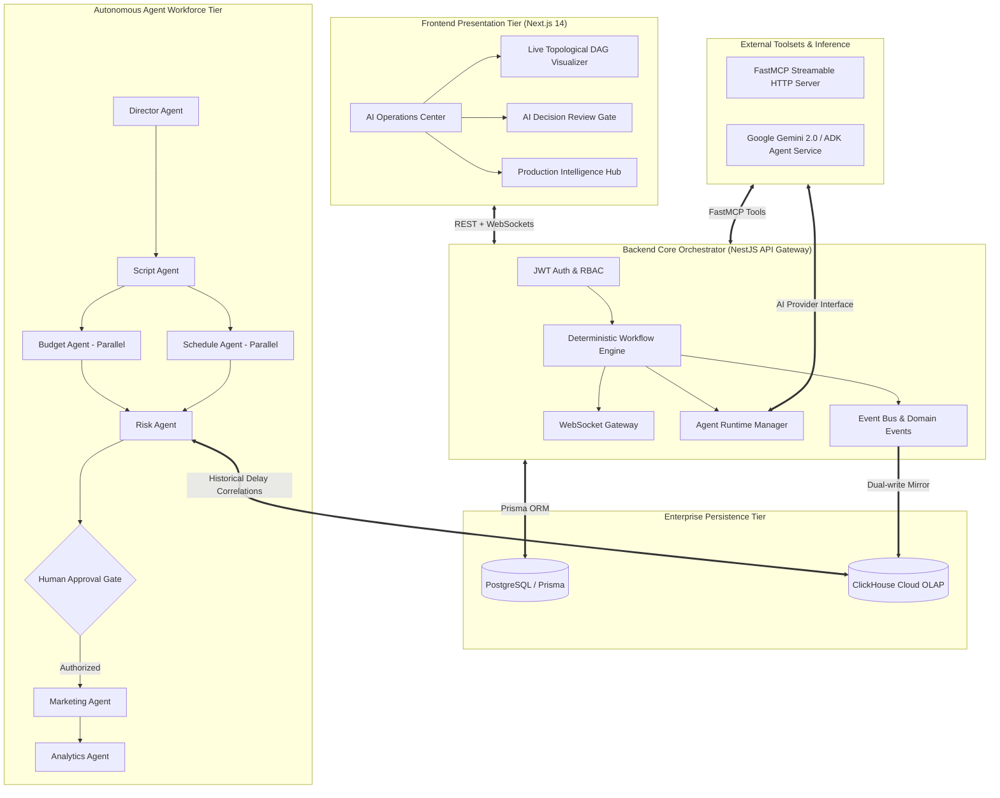

# Orkestra 🎬

**The Enterprise Autonomous AI Operating System for Media Production**  
*Direct the vision. Let AI orchestrate the execution with data-grounded governance.*

[](LICENSE)
[](https://cloud.google.com/)
[](https://clickhouse.com/)
[](https://modelcontextprotocol.io/)

---

## 🌟 Executive Summary

**Orkestra** is a competition-grade, production-ready AI orchestration platform designed for modern studios and media enterprises. Built for the **Google Cloud Summer Blockbuster Hackathon**, Orkestra transforms fragmented pre-production workflows into a synchronized multi-agent state machine.

An executive **Director Agent** coordinates six specialized AI agents (**Script**, **Budget**, **Schedule**, **Risk**, **Marketing**, and **Analytics**). Unlike standard probabilistic chatbots, Orkestra executes a deterministic Directed Acyclic Graph (DAG) with **Google ADK multi-agent orchestration**, **FastMCP tool servers**, **ClickHouse OLAP historical intelligence**, and an executive **Human-in-the-Loop AI Decision Review Gate** enforcing separation of duties.

---

## 🏛️ System Architecture



---

## 👥 The Autonomous Agent Workforce

| Agent | Identity & Scope | Key Tools & Intelligence Source |
| :--- | :--- | :--- |
| **Director Agent** | Executive vision, production brief planning, and DAG orchestration | Gemini 2.0 Flash / Pro, Studio Brief Tool |
| **Script Agent** | Screenplay analysis, scene breakdowns, character extraction, VFX tagging | FastMCP Screenplay Analysis Tool |
| **Budget Agent** | Departmental cost modeling, line-item allocations, cash flow planning | Financial Model Engine |
| **Schedule Agent** | Production calendar optimization, location logistics, parallel unit timelines | Logistics & Scheduling Matrix |
| **Risk Agent** | Data-grounded hazard audit, delay forecasting, safety & policy gates | **ClickHouse Historical Telemetry (via MCP)** |
| **Marketing Agent** | Demographic targeting, multi-channel promotional strategy, rollout timeline | Audience Segmentation Engine |
| **Analytics Agent** | End-to-end execution benchmarks, agent latency telemetry, audit logs | ClickHouse OLAP Analytics Mirror |

---

## 🛡️ Enterprise Human-in-the-Loop AI Decision Review

Orkestra strictly adheres to the principle that **AI recommends, humans authorize**:

1. **Empirical Evidence Grounding**: The Risk Agent does not hallucinate arbitrary risk percentages. It queries ClickHouse historical production datasets via FastMCP (`query_production_intelligence`) to benchmark actual schedule compression and cost overruns.
2. **Structured AI Decision Review**:
   - **Decision Required**: Specific budget or schedule contingency authorization.
   - **Risk Level**: Clear `LOW`, `MEDIUM`, `HIGH`, or `CRITICAL` categorization.
   - **Data Sources**: Full provenance breakdown highlighting ClickHouse OLAP metrics.
   - **Contributing Factors & Impact**: Granular listing of affected workflow stages.
   - **Action Gates**: `[Reject Decision]` or `[Approve & Execute Workflow]`.

---

## 🎬 Flagship Demo Flow: "The Last Horizon"

1. **Launch**: Create or navigate to the flagship sci-fi epic *"The Last Horizon"* ($8,500,000 budget).
2. **Autonomous Fan-Out**: Click **Launch AI Workflow**. Watch the live topological DAG visualizer execute the Director Plan and Script Breakdown, then fan-out into parallel Budget and Schedule generation.
3. **Historical Risk Analysis**: The Risk Agent queries ClickHouse historical benchmarks, discovers a 32% turnaround risk due to compressed stage dates, and triggers the **Human Governance Gate**.
4. **Interactive AI Decision Review**: Open the **Decision Review Gate**. Inspect the evidence, statistical correlation scores, and system recommendation.
5. **Human Approval & Completion**: Approve the contingency buffer. The workflow seamlessly resumes, executing Marketing distribution strategy and final Analytics audit.

---

## 🚀 Quick Start Guide

### Prerequisites
- **Node.js**: v18+ or v20+
- **Docker & Docker Compose**
- **Python**: 3.10+ (for real ADK / FastMCP service, optional)

### 1. Start Infrastructure (PostgreSQL + ClickHouse)
```bash
docker compose up -d postgres clickhouse
```

### 2. Configure & Start Backend API
```bash
cd apps/api
cp .env.example .env
npm install
npx prisma generate
npx prisma migrate dev --name init
npm run prisma:seed          # Populates demo organization, users & "The Last Horizon"
npm run start:dev            # API running at http://localhost:4000/api/v1
```

*Default Seeded Login Credentials:*
- **Email:** `producer@demo.studio`
- **Password:** `OrkestraDemo123!`

### 3. Configure & Start Web Frontend
```bash
cd apps/web
npm install
npm run dev                  # Web UI running at http://localhost:3000
```

### 4. (Optional) Run FastMCP Server & Google ADK Multi-Agent Service
```bash
# Start FastMCP Server
cd services/mcp-server
python -m venv .venv
source .venv/bin/activate    # On Windows: .venv\Scripts\activate
pip install -r requirements.txt
python server.py

# Start Google ADK Agent Service
cd services/adk-agent
python -m venv .venv
source .venv/bin/activate    # On Windows: .venv\Scripts\activate
pip install -r requirements.txt
export GEMINI_API_KEY="your-api-key"
python -m uvicorn orkestra_agents:app --port 8000
```

---

## 🧪 Testing Suite

Orkestra includes automated unit and integration tests covering the deterministic state machine, ClickHouse historical query fallbacks, and the grounded Risk Agent:

```bash
cd apps/api
npm test
```

---

## 📄 Open Source License

Orkestra is open source software licensed under the **[Apache License 2.0](LICENSE)**.
